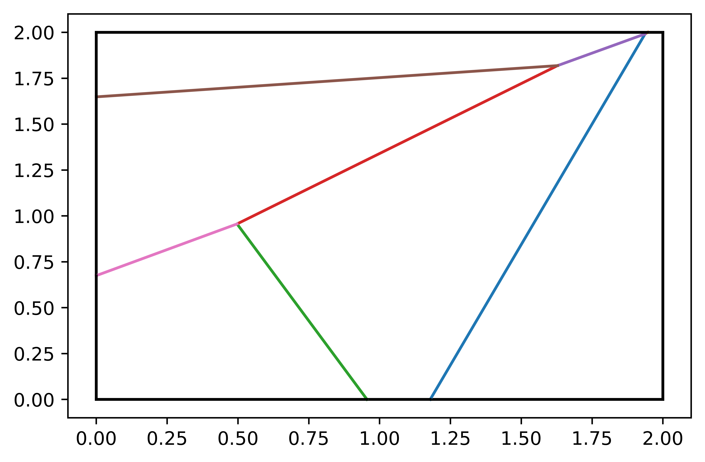

# This is the subset for mesh generate and other mesh related operations

- ExtractGBC: combine all the grain boundary to use one same id, keep the indenpendent id for each grain, and also split the boundary edge with an independent id, write result to a new geo file.

